# LLD  — 12 Pattern Mindmaps 

---

## #1 OOP Modelling & SOLID (the foundation)
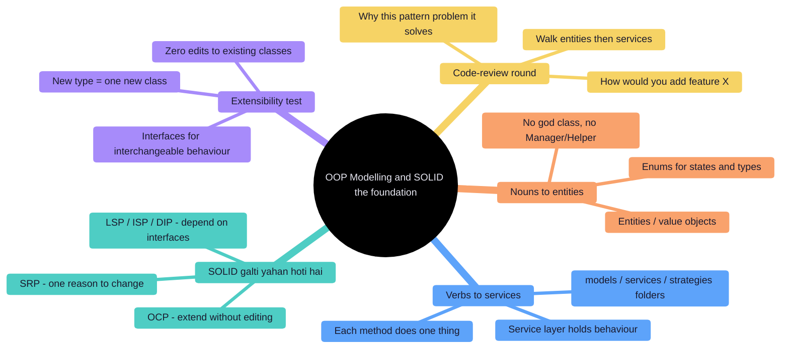

## #2 Design Patterns (Strategy / State / Factory / Observer / Decorator)
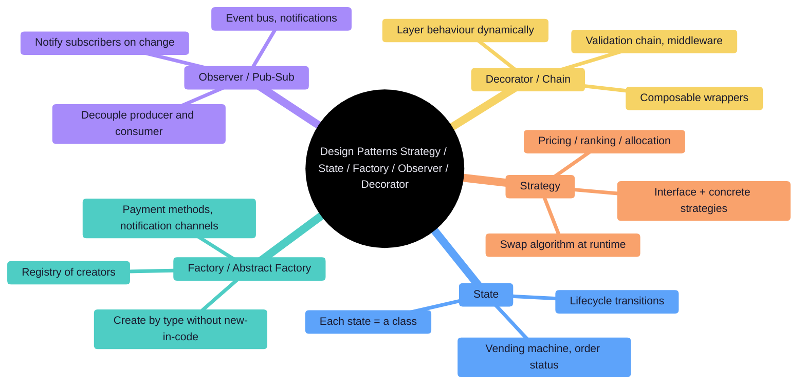

## #3 In-memory Store, Cache & KV (with iterators, TTL, snapshots)
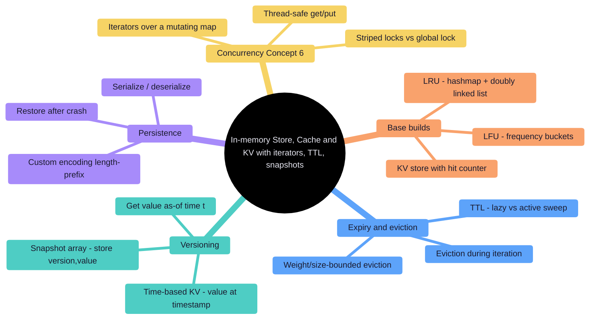

## #4 Rate Limiter, Scheduler & Concurrency Control
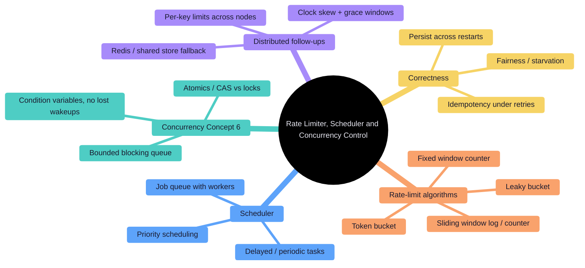

## #5 Event Systems, Notification & Pub-Sub
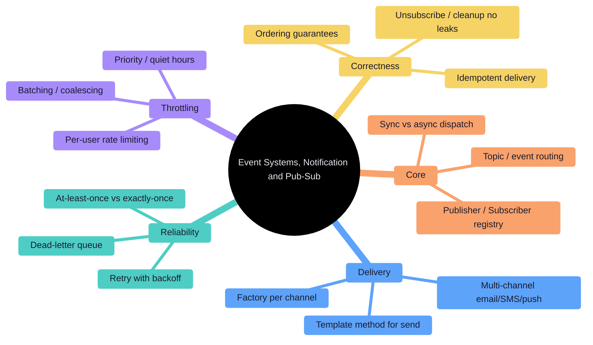

## #6 Concurrency Primitives in LLD (thread-safety follow-ups)
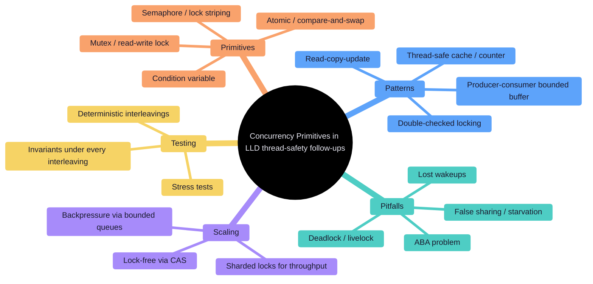

## #7 Parsers, Interpreters, Tokenizers & Rule Engines
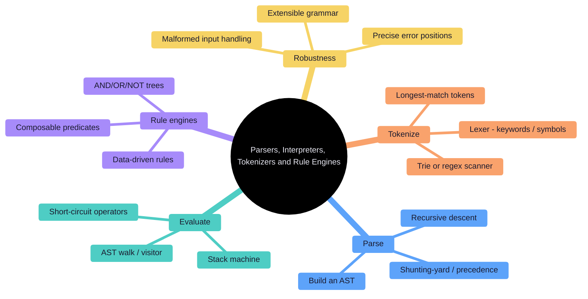

## #8 Booking, Inventory & Reservation Systems
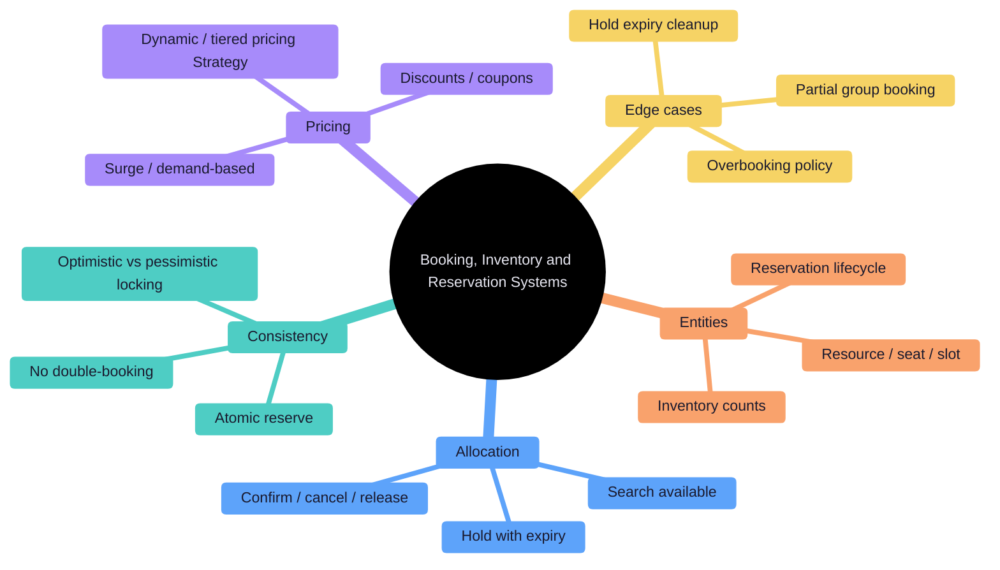

## #9 Games, Simulations & State Machines
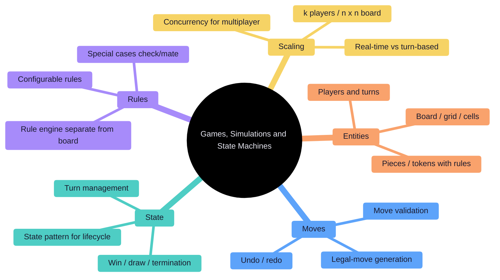

## #10 File Systems, Iterators & Custom Collections
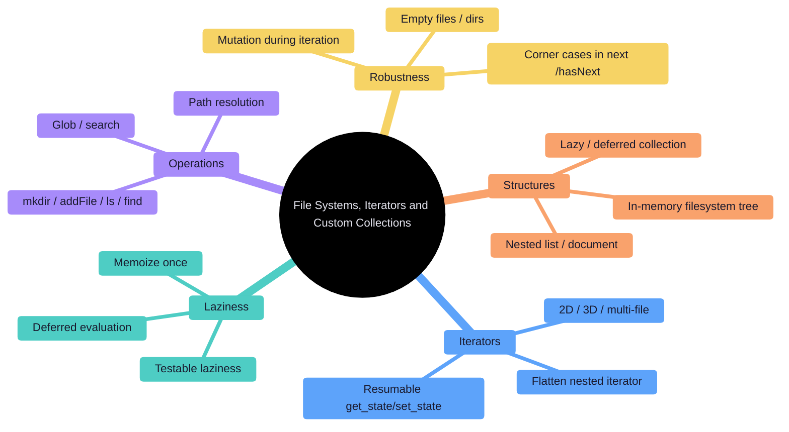

## #11 AI-coding, Agentic & Take-home Rounds (2026)
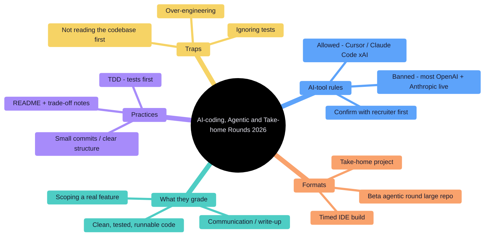

## #12 Testing, Extensibility & the Code-Review Round
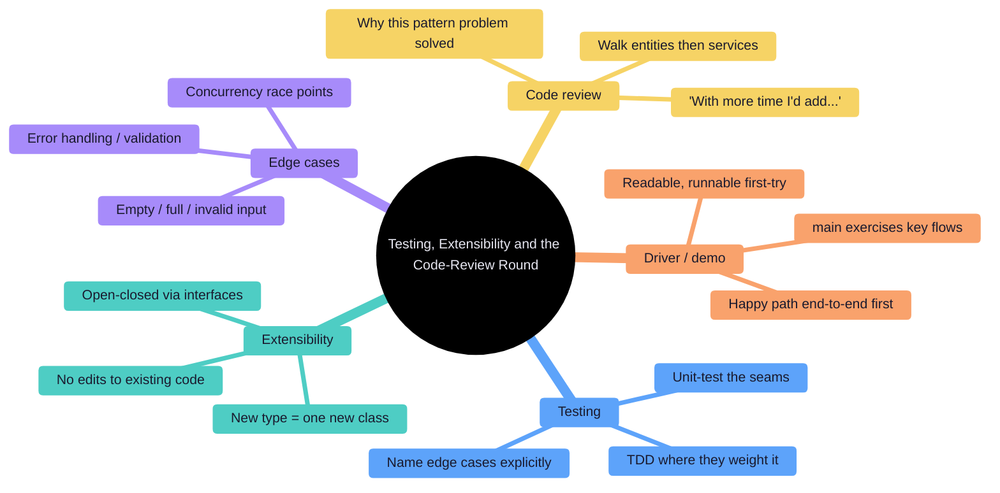
