# NeetCode 150 — 21 Mindmaps (Hinglish, mermaid source)
Kisi bhi block ko https://mermaid.live me paste karke diagram dekho. Branch labels Hinglish me hain, technical terms English me.

---

## #1 Merge K Sorted Lists
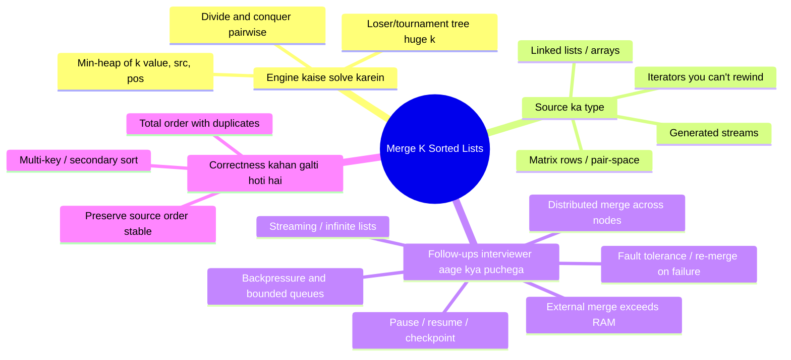

## #2 Sliding Window
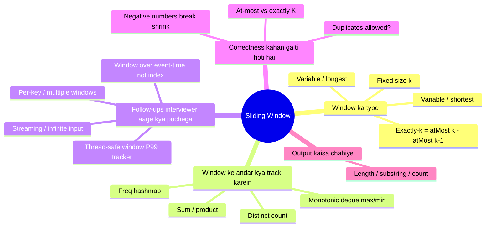

## #3 Two Pointers
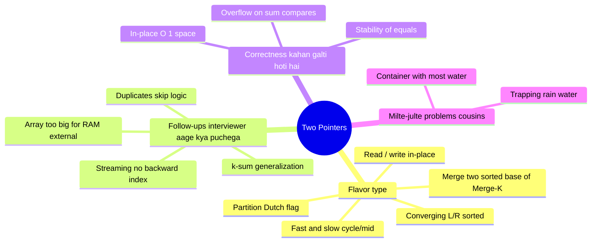

## #4 Prefix Sum + HashMap
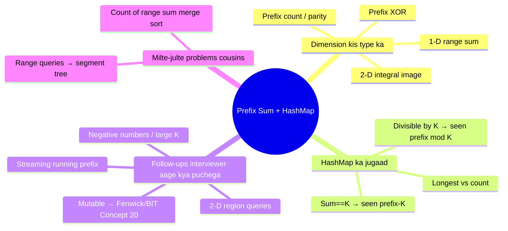

## #5 Monotonic Stack
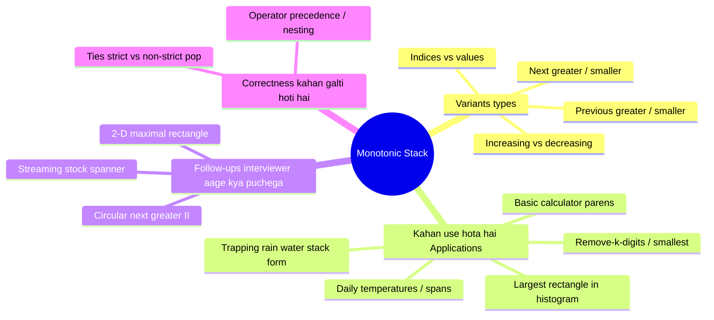

## #6 Binary Search (value & answer-space)
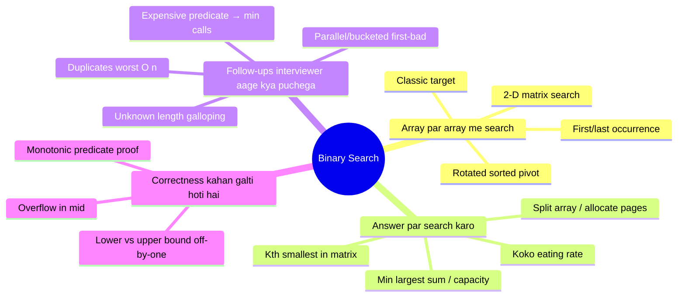

## #7 Trees & Graph Traversal (DFS / BFS / Multi-source)
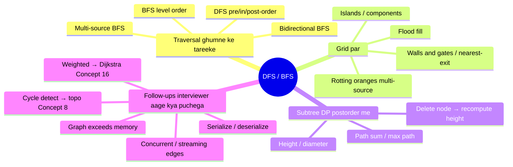

## #8 Topological Sort (DAG ordering)
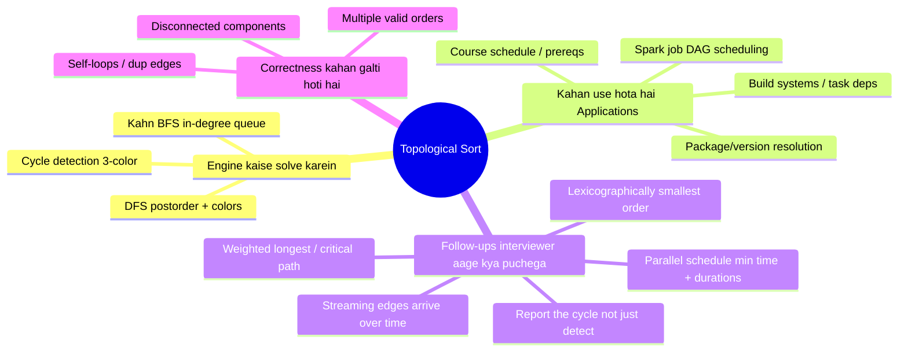

## #9 Union-Find (Disjoint Set Union)
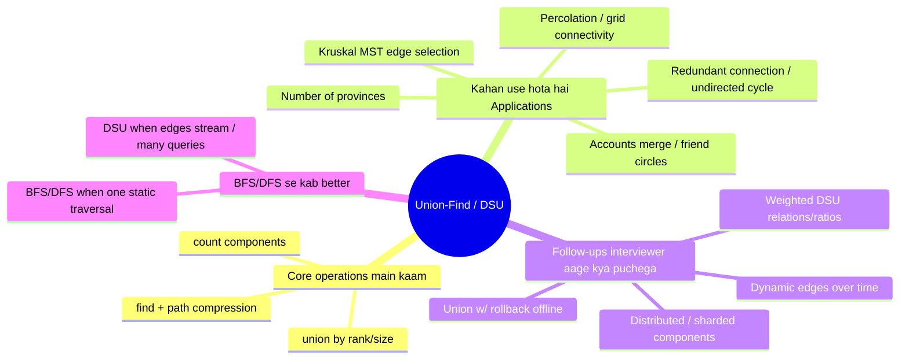

## #10 Backtracking
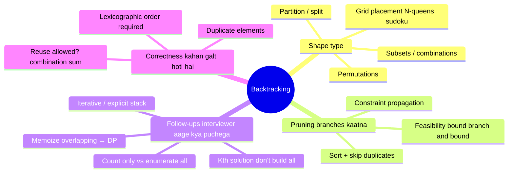

## #11 Dynamic Programming
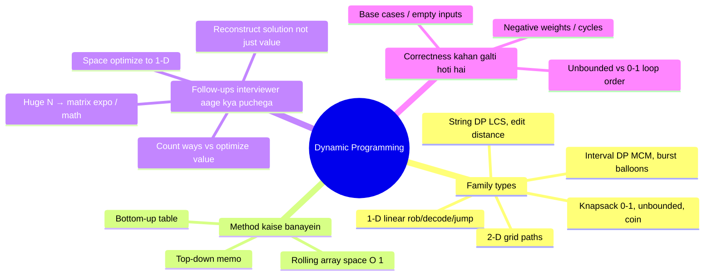

## #12 Intervals & Sweep Line
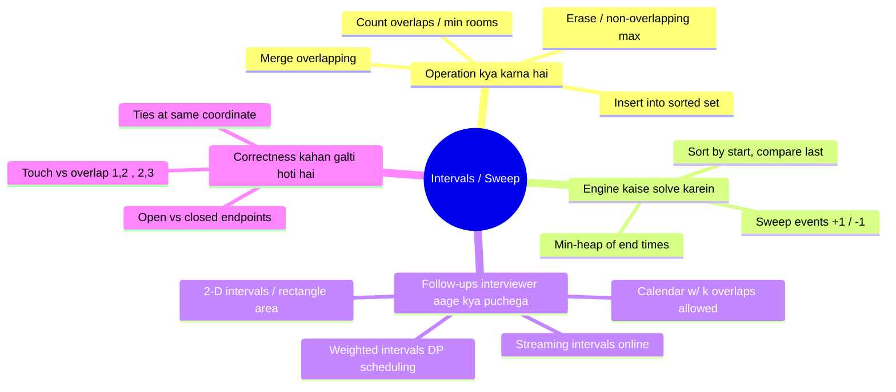

## #13 Design / In-Memory Stores (LRU, TTL, iterators)
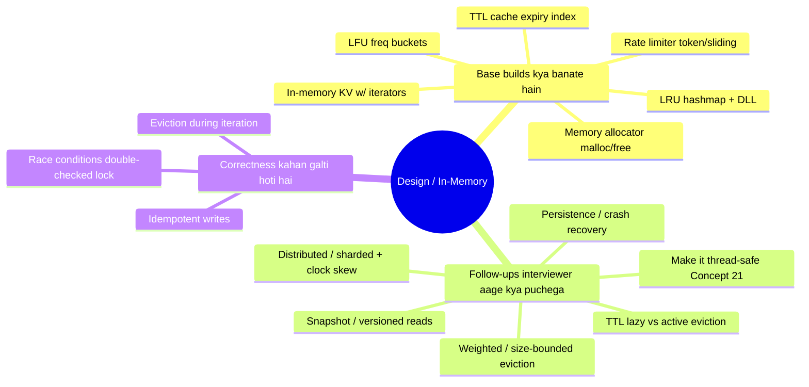

## #14 Fast & Slow Pointers / Linked-List Surgery
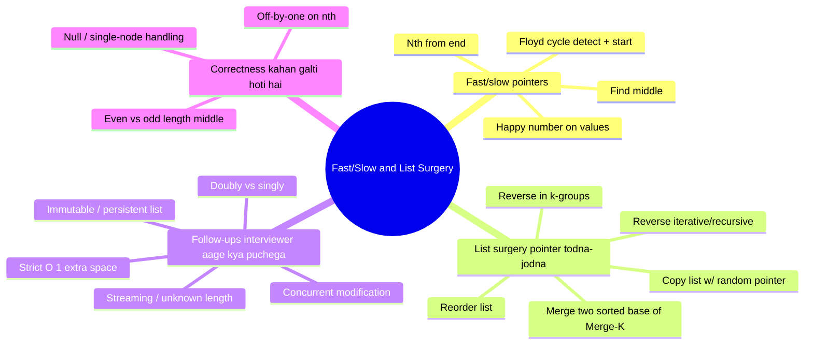

## #15 Trie (Prefix Tree)
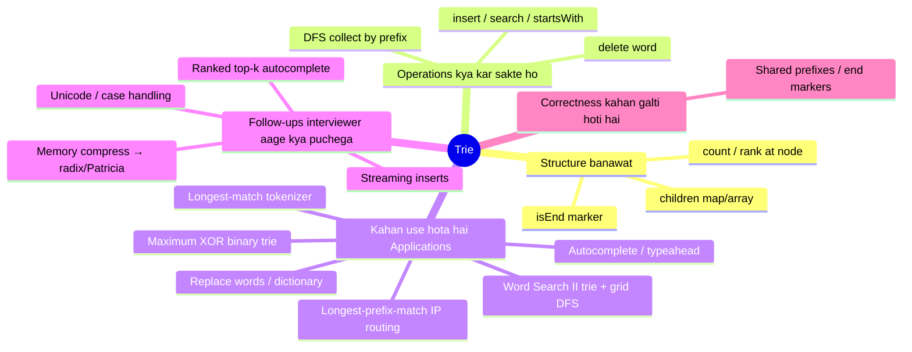

## #16 Dijkstra / Bellman-Ford / MST (weighted graphs)
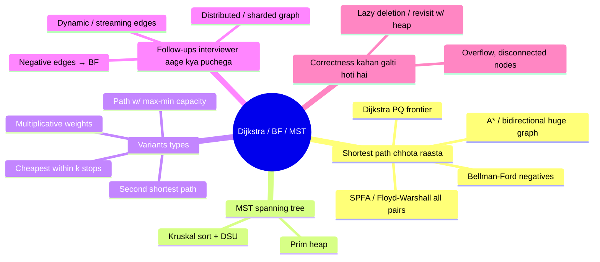

## #17 Bit Manipulation
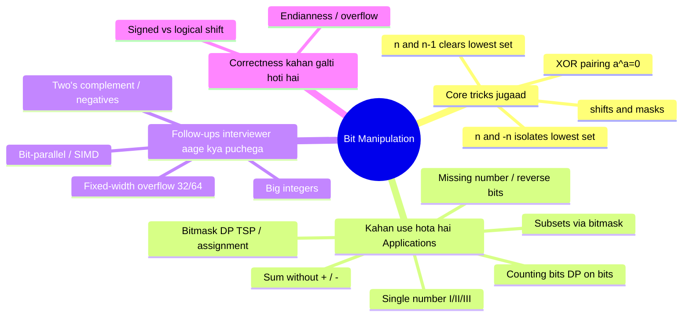

## #18 Math & Geometry
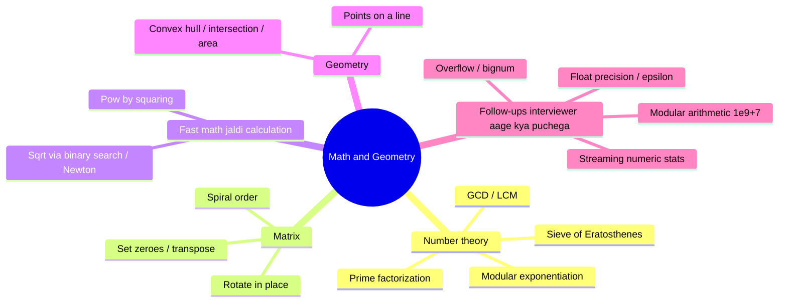

## #19 Greedy (interval scheduling, Huffman)
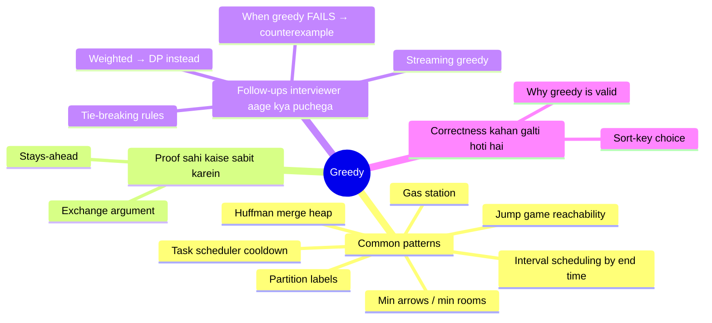

## #20 Segment Tree / Fenwick (BIT) — the mutable-range escalation
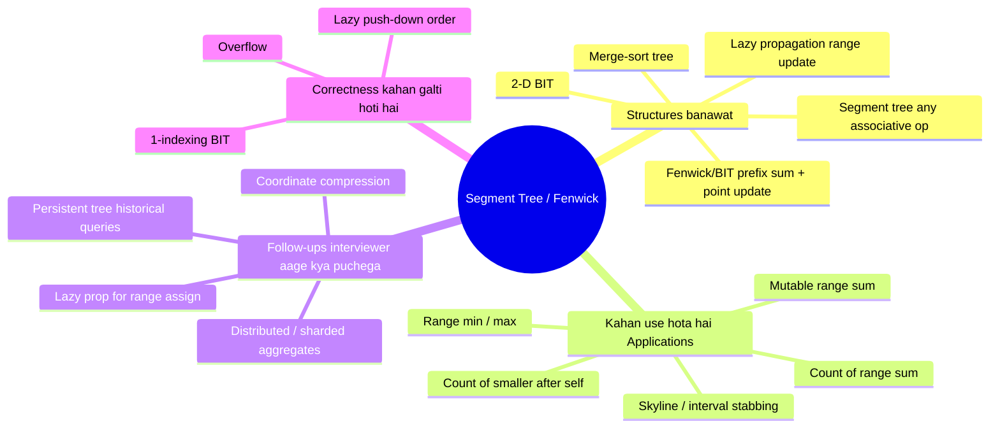

## #21 Concurrency Primitives (cross-cutting: Anthropic / Netflix / Citadel)
```mermaid
mindmap
  root((Concurrency Primitives))
    Primitives basic tools
      Mutex / lock
      Read-write lock
      Atomic / CAS
      Condition variable
      Semaphore
      Lock striping / sharding
    Common patterns
      Producer-consumer bounded buffer
      Thread-safe cache / counter
      Double-checked locking
      Read-copy-update
      Futures / async
    Pitfalls kahan phasoge
      Deadlock / livelock
      Lost wakeups
      ABA problem
      False sharing / starvation
    Follow-ups interviewer aage kya puchega
      Lock-free via CAS
      Sharded locks for throughput
      Backpressure / bounded queues
      Clock skew distributed + idempotency
    Correctness kahan galti hoti hai
      Invariants under interleaving
      Memory visibility / happens-before
```
